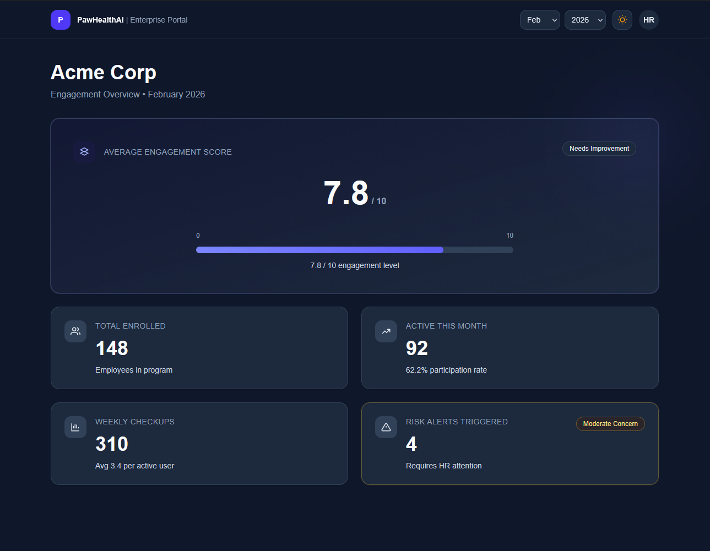

A Next.js dashboard for viewing monthly employee wellness engagement metrics for an enterprise HR team.

## Overview
This app renders a metrics dashboard with:
- A month/year filter
- Light and dark theme toggle
- A hero engagement score card with visual progress bar
- KPI cards for enrolled employees, active users, checkups, and risk alerts
- Loading skeletons and retryable error state
- Defensive handling for missing or partial metric data
## Getting Started

### 1. Install dependencies

```bash
npm install
```
### 2. Run the dev server

```bash
npm run dev
```

Open `http://localhost:3000`.
## Mock Data Modes

Data is currently provided by `lib/api.ts` with configurable mock behavior via `NEXT_PUBLIC_MOCK_MODE`.

Supported values:
- `normal` (default): deterministic generated metrics by month/year
- `missing`: returns partial metrics with undefined fields
- `zero`: returns all key metrics as zero
- `error`: throws an API-style error for testing retry UX
## 1) Project Structure

```text
app/
  layout.tsx               # Root layout + ThemeProvider
  page.tsx                 # Dashboard entry page
components/
  MetricCard.tsx           # Shared metric card + tone variants
  ThemeProvider.tsx        # Theme context + localStorage persistence
  UserMenu.tsx             # Top-right profile dropdown
  dashboard/
    DashboardSection.tsx   # Main dashboard composition
    DashboardTopBar.tsx    # Brand, date filters, theme toggle, user menu
    EngagementBar.tsx      # Visual score bar (0-10)
hooks/
  useCompanyMetrics.ts     # Data loading, error/loading states, computed KPIs
lib/
  api.ts                   # Mock API + scenario modes
  types.ts                 # Response and metric types
  format.ts                # Number/percent formatting helpers
  dashboard/helpers.ts     # Labels, tones, numeric guards
```
## 2) Key Decisions Made

- Kept business logic in `useCompanyMetrics` so display components stay mostly presentational.
- Used a reusable `MetricCard` to avoid repeated styling/markup and keep visual consistency.
- Treated API fields as optional and added explicit fallback behavior (`"—"`, unavailable labels) to prevent UI crashes.
- Added deterministic mock data generation by month/year to make testing behavior reproducible.
- Included explicit loading and retryable error states to improve UX reliability.

## 3) Assumptions

- Data is currently mock data; there is no production backend integration yet.
- Metrics can be missing, zero, or delayed, so the UI must remain valid in incomplete states.
- Dashboard users are HR/internal users who need a quick monthly health snapshot, not detailed drill-down analytics.
- Current scope targets one company view at a time.

## 4) What I Would Improve With More Time

- Replace mock API with real backend integration and typed runtime validation.
- Add tests (unit tests for helpers/hooks and integration tests for loading/error/data states).
- Improve accessibility (keyboard/focus behavior, ARIA review, contrast audit).
- add the route protection to prevent someone try to access the web with many tries